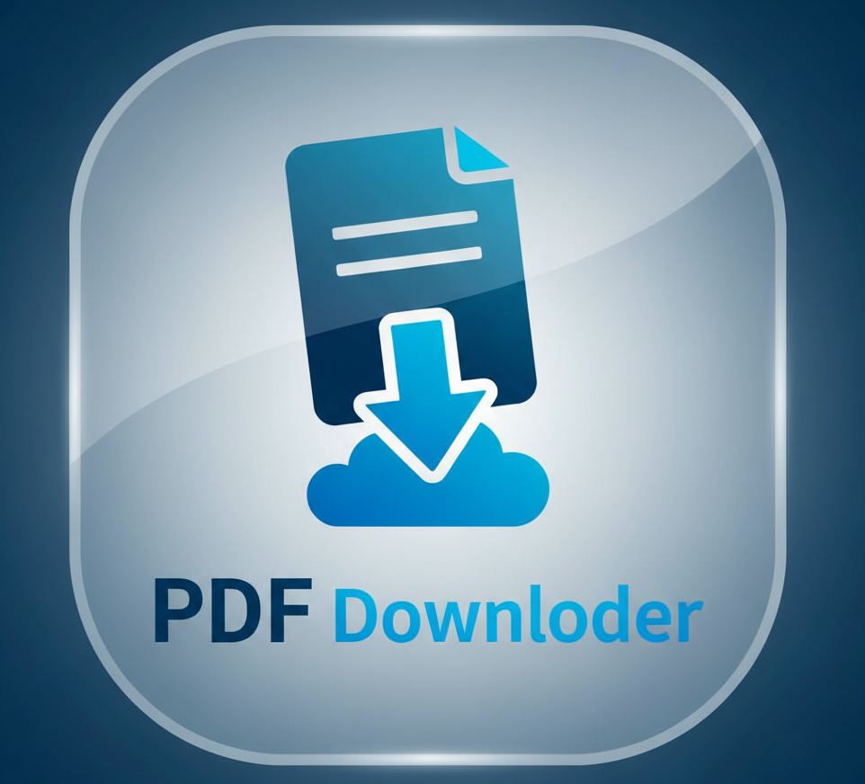

# 📘 PDF Downloader  

  

**Created by Srijan | Srijanxi Technologies**  

A professional **Tkinter-based PDF downloader** with concurrent downloads, network speed monitoring, and pause/resume functionality. Easily build standalone executables for Windows, Linux, and macOS.  

---

## ✨ Features  

- **Concurrent Downloads** – Download multiple PDFs simultaneously (configurable 1–10 threads).  
- **Network Speed Monitoring** – Real-time download speed display in MB/s.  
- **Pause/Resume** – Pause and resume downloads anytime.  
- **Recursive Scanning** – Automatically discover PDFs in nested directories.  
- **Progress Tracking** – Visual progress bar and detailed logging.  
- **Custom Icon** – Application icon for both EXE and GUI window.  
- **Cross-Platform** – Build and run on Windows, Linux, and macOS.  

---

## 📁 Project Structure  

```plaintext
Pdf Downloader/
├── 📄 Core Files
│   ├── pdf_downloads.py        # Main application
│   ├── requirements.txt        # Dependencies
│   ├── README.md               # Documentation
│   ├── .gitignore              # Git ignore rules
│   ├── run.bat                 # Quick launcher (Windows)
│   └── run.sh                  # Quick launcher (Linux/macOS)
│
├── 🎨 icon/
│   └── logo_pdf.png            # Application icon
│
├── 🔧 scripts/
│   ├── build_exe.ps1           # Windows build script
│   ├── build_app.sh            # Linux/macOS build script
│   ├── convert_icon.py         # Icon converter
│   ├── pdf_downloader.spec     # PyInstaller spec
│   ├── run_pdf_downloader.bat  # Legacy Windows launcher
│   └── run_pdf_downloader.sh   # Legacy Linux launcher
│
├── 📚 docs/
│   ├── CODE_FIXES.md           # Code improvements log
│   └── REORGANIZATION.md       # Project structure changes
│
└── 🏗️ Generated (after build)
    ├── dist/                   # Built executables
    ├── build/                  # Build artifacts
    └── venv/                   # Virtual environment
```
---
## 🚀 Quick Start
### 🪟 Windows
```
# Allow script execution (first time only)
Set-ExecutionPolicy -ExecutionPolicy RemoteSigned -Scope Process

# Build the application
.\scripts\build_exe.ps1

# Run the application
.\run.bat
```
### 🐧 Linux/macOS
```bash
# Make scripts executable
chmod +x scripts/build_app.sh run.sh

# Build the application
./scripts/build_app.sh

# Run the application
./run.sh
```
### 📋 Prerequisites

- Python 3.8+ installed and available as python (Windows) or python3 (Linux/macOS).

- Internet access to install required dependencies.

### 🛠️ Building from Source
🪟 Windows (PowerShell)
```powershell
# Allow script execution (first time only)
Set-ExecutionPolicy -ExecutionPolicy RemoteSigned -Scope Process
.\scripts\build_exe.ps1
```

### 🐧 Linux/macOS (Bash)
```bash
chmod +x scripts/build_app.sh
./scripts/build_app.sh
```

### ▶️ Running the Application

```Windows:

run.bat
```

```Linux/macOS:

./run.sh
```

---

Or execute directly after build:

Windows: `.\dist\pdf_downloader.exe`

Linux/macOS: `./dist/pdf_downloader`

---

### 💡 Advanced Usage
Manual PyInstaller Build

Windows:

```powershell
pyinstaller --noconfirm --onefile --windowed --icon=icon\logo_pdf.ico --add-data "icon;icon" --name "pdf_downloader" pdf_downloads.py
```

Linux/macOS:

```bash
pyinstaller --noconfirm --onefile --windowed --icon=icon/logo_pdf.ico --add-data "icon:icon" --name "pdf_downloader" pdf_downloads.py
```

Note: The `--add-data` separator is ; on Windows and : on Linux/macOS.

---

  

---

### 🧩 Console Window

By default, the build hides the console (`--windowed`).
To view logs, remove `--windowed` from your build script.

## 📦 Dependencies

`requests` – For downloading files

`beautifulsoup4` – For HTML parsing

`pillow` – For icon conversion

`pyinstaller` – For building executables

All dependencies install automatically during the build process.

---

## 🤝 Contributing

We welcome contributions! Please see [CONTRIBUTING.md](docs/CONTRIBUTING.md) for:
- How to report bugs
- How to suggest features
- Development setup instructions
- Code standards and guidelines
- Pull request process

Whether it's bug fixes, feature requests, or documentation improvements, we appreciate your help!

---

## 📄 License

This project is open source and available for personal and commercial use.

---

**Created by Srijan | Srijanxi Technologies**  
*Made with ❤️ for easy PDF downloading*# PDF-Downloader
